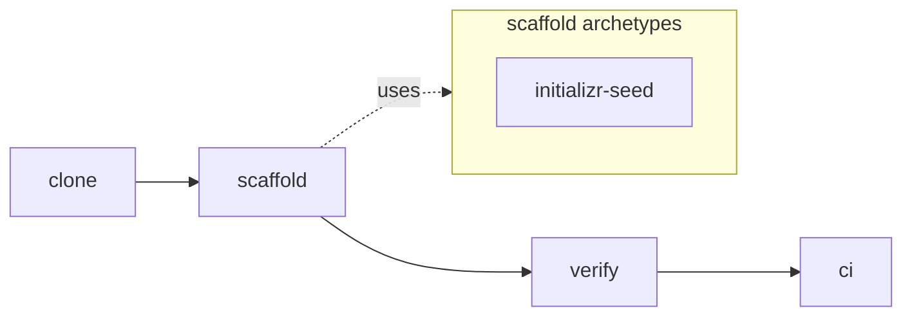

# Spring Boot Template — Setup Guide

> Clone this template, run one script, get a Spring Boot 3 project scaffolded
> with a green CI pipeline. See [ADR-002](docs/architecture/decisions/ADR-002-clone-script-scaffolding.md)
> for the architecture rationale.

## Phase 0: System Overview

> This template is designed for LLM agents to extend autonomously.



| ENV / Dependency | Type | Default | Change blast radius |
|---|---|---|---|
| Java toolchain | runtime | Temurin 21 | high |
| `BASE_PACKAGE` | scaffold param | required | medium |
| `PROJECT_NAME` | scaffold param | required | low |
| `.github/workflows/validate.yml` | CI workflow | committed | medium |
| `.agents/rules/plan-review-deep.md` | governance | byte-identical 3 templates | high |

### Adding a new archetype
Add a directory under `examples/` and update `scaffold.sh` archetype dispatch + the archetypes subgraph above. Phase 14b is the canonical Phase for archetype expansion.

### Adding a new verify step
Add a new `=== V<N> <name> ===` block to `validate.sh` AFTER V0a/V0e/V_seed and BEFORE V1+. Update F1 echo headers if the step exposes a new failure surface. See `.agents/rules/plan-review-deep.md` Section 2.

### Adding a new env dependency
Add a row to the ENV table above and rate its blast radius (low/medium/high). If required for `validate.sh` to run, add a presence guard at the top of `validate.sh`.

### Phase E (DDD/TDD) stack hook
1. Flexibility: small UL/BC edits (2-3 words or additions) allowed; core domain redefinition requires a new project.
2. Universality: rule semantics MUST be expressible in terms common to all 3 stacks (Spring/Python/TS).
3. Convention precedence: per-stack idiom > shared abstraction when they conflict -- convention wins, abstractions are opt-in.
4. Contract test specifications: every cross-stack rule has an executable contract test in each template (no English-only enforcement).
5. Opt-in examples / docs / CI only: examples + docs are opt-in; CI gates are opt-in unless a Phase explicitly opts a rule into the V0/V_seed contract.

---

## 1. Quick Start (three commands)

```bash
git clone https://github.com/llm-setup-templates/spring-template my-spring-app
cd my-spring-app
bash ./scaffold.sh --project-name my-spring-app --base-package com.example.myspringapp
```

> **Run under Bash** — not PowerShell or cmd.exe. On Windows this means
> Git Bash, WSL, or any shell where `bash --version` prints a version.
> The `bash` prefix is **load-bearing**: PowerShell's `.\scaffold.sh` form
> produces a silent no-op (exit 0, no scaffolding) in headless contexts
> (CI runners, agent sandboxes). scaffold.sh's internal guard catches
> dash/sh/zsh invocations that parse the script body, but PowerShell's
> invocation path never reaches that guard. See [RATIONALE.md § PowerShell
> Silent-No-Op](./RATIONALE.md) for the empirical test matrix.

Then verify locally:

```bash
./gradlew format
./gradlew checkFormat checkstyleMain checkstyleTest spotbugsMain test build bootJar
git add .
git commit -m "feat(scaffold): initial project setup"
```

## 2. scaffold.sh Reference

```
Usage: ./scaffold.sh --project-name <hyphen-case> --base-package <dotted> [options]

Required:
  --project-name <name>   Project name in hyphen-case (e.g. my-spring-app)
  --base-package <pkg>    Java base package in dotted lowercase (e.g. com.example.myapp)

Optional:
  --doc-modules <list>    comma-separated from {core,reports,briefings,extended}
                          default: core. 'core' is mandatory.
  --dry-run               Print planned actions without writing.
  -h, --help              Print this usage.
```

**What scaffold.sh does** (8 stages, see [ADR-002](docs/architecture/decisions/ADR-002-clone-script-scaffolding.md)):

| Stage | Action |
|---|---|
| A | Remove template-only files (`validate.sh`, `.github/workflows/validate.yml`, template dependabot configs, `RATIONALE.md`, `CODERABBIT-PROMPT-GUIDE.md`, `test/`, ADR-002). Keeps `.claude/` (agent rules) + `examples/` (used by Stage C). |
| B | Single archetype (web-mvc) — no archetype selection (vs Python's 3-archetype split, see [RATIONALE § archetype](./RATIONALE.md)). |
| C | Copy Initializr seed (`examples/initializr-seed/`) + template-specific assets to repo root. `logback-spring.xml` lands at `src/main/resources/logback-spring.xml` (root level — Spring Boot's auto-load path). |
| D | Substitute placeholders: `{{PROJECT_NAME}}` (AGENTS.md, settings.gradle.kts, aws/), `{{PROJECT_ONE_LINER}}` (AGENTS.md), `{{BASE_PACKAGE}}` (all `src/**/*.{java,yml,xml}`), 9 AWS dummy ARNs (aws/task-definition.json). Migrates Initializr seed `com.example.template` → `$BASE_PACKAGE` directory + package declarations. |
| E | Trim unselected doc modules (`docs/reports/`, `docs/briefings/`, or `docs/architecture/{containers,DFD}.md` + `docs/data/`). |
| F | Remove `examples/` + Initializr's default `application.properties` (conflicts with template's `application.yml`). |
| G | `rm -rf .git && git init -b main` (fresh history — template history not inherited). |
| H | Print next steps + self-delete (Linux/macOS auto, Windows Git Bash requires manual `rm scaffold.sh`). |

**Single-use**: scaffold.sh runs once on a freshly cloned template. It detects
`validate.sh` presence as a freshness marker; if missing (because a previous
scaffold run removed it), the script refuses to run and instructs you to re-clone.

## 3. Archetype

### 3.1 Default scaffold output: web-mvc (single)

scaffold.sh produces **one archetype**: production-grade Spring Boot web-MVC with:

- `src/main/java/<base-package>/` — layered architecture under your `--base-package`
- `core/api/support/ApiControllerAdvice.java` — global exception handler
- `support/error/{CoreException, ErrorCode, ErrorType}.java` — error hierarchy
- `support/response/{ApiResponse, ResultType}.java` — standardized API envelope
- `config/AppProperties.java` — `@ConfigurationProperties(prefix = "app")` example
- `src/test/java/<base-package>/architecture/ArchitectureTest.java` — 12 ArchUnit rules

Archetype splits (batch / library / data) are Phase 14b candidates. See [RATIONALE § archetype](./RATIONALE.md).

### 3.2 Worked example: archetype-ddd-pilot (Phase E0)

`examples/archetype-ddd-pilot/` is a **standalone learning artifact** demonstrating jMolecules + Spring Modulith + ArchUnit DDD rules + Classicist TDD with Testcontainers. **Removed by scaffold.sh Stage F** -- it does not appear in scaffolded output. To learn from it: `cd examples/archetype-ddd-pilot && ./gradlew test` (requires Docker for Testcontainers).

## 4. Publish to GitHub (optional)

scaffold.sh does **not** create a GitHub repository — that's a separate
step, decoupled from scaffolding. This lets scaffold.sh work in offline
environments, self-hosted GitLab/Gitea mirrors, or air-gapped CI.

To publish after scaffolding + first commit:

```bash
gh auth status
gh repo create <repo-name> --private --source=. --remote=origin
git push -u origin main
```

### First-push CI recovery

If `git push` does not automatically trigger a CI run on `main` (race with
GitHub's default-branch bootstrap on brand-new repos), trigger manually:

```bash
gh workflow run ci.yml --ref main
gh run watch
```

`workflow_dispatch` is wired into `ci.yml` for this recovery case.

## 5. Verification

Full local verification loop:

```bash
./gradlew format \
  && ./gradlew checkFormat checkstyleMain checkstyleTest spotbugsMain test build bootJar
```

Runs in CI (`.github/workflows/ci.yml`) on every push to `main`/`dev` and every PR.

**Docker smoke test (optional — requires Docker running):**

```bash
docker build -t app-local .
docker-compose up -d db
sleep 8
docker-compose ps db | grep -q "healthy" || { echo "DB healthcheck failed"; docker-compose down; exit 1; }
docker-compose down
```

## 6. CODEOWNERS customization

**Required before enabling branch protection reviews.** `.github/CODEOWNERS`
ships with three placeholder groups:

- `@YOUR_ORG/engineering` — default owner (wildcard fallback)
- `@YOUR_ORG/architects` — decisions, `core/`, ArchUnit rules
- `@YOUR_ORG/devops` — CI/CD, dependency surface, Dockerfile

Sweep substitution:

```bash
# Solo project:
sed -i "s|@YOUR_ORG/[a-z-]*|@YOUR_USERNAME|g" .github/CODEOWNERS

# Team project (example):
sed -i "s|@YOUR_ORG/engineering|@my-team/eng|g;
        s|@YOUR_ORG/architects|@my-team/architects|g;
        s|@YOUR_ORG/devops|@my-team/platform|g" .github/CODEOWNERS

# Verify:
grep -n "YOUR_ORG\|YOUR_USERNAME" .github/CODEOWNERS  # must be empty
```

## 7. Troubleshooting

| Problem | Cause | Solution |
|---------|-------|----------|
| `scaffold.sh: /bin/bash^M: bad interpreter` | CRLF line endings (Windows) | `dos2unix scaffold.sh` or re-clone with `core.autocrlf=false` |
| `ERROR: validate.sh not found` | scaffold.sh already ran once | Re-clone the template — scaffold.sh is single-use |
| `ERROR: scaffold.sh must be executed by Bash.` | Invoked via dash/sh/zsh that parsed the script body | Prefix `bash`: `bash ./scaffold.sh --project-name X --base-package Y`. On Windows use Git Bash or WSL. |
| `./scaffold.sh` in PowerShell appears to do nothing (exit 0, no output, no scaffolding) | PowerShell's `.\<name>` form bypasses `.sh` file-association dispatch for headless invocations. Silent no-op; script body never parsed. | Always use `bash ./scaffold.sh ...` explicitly. On Windows prefer Git Bash or WSL over PowerShell. See [RATIONALE.md § PowerShell Silent-No-Op](./RATIONALE.md). |
| scaffold.sh aborted mid-stage | Stage A/C/D/F failure (permission denied, missing file, etc.) | **Re-clone the template** — partial scaffold state cannot be recovered: `cd .. && rm -rf my-spring-app && git clone https://github.com/llm-setup-templates/spring-template my-spring-app && cd my-spring-app && bash ./scaffold.sh ...`. The freshness check (validate.sh missing) blocks retry on partial state. |
| `cp: cannot create ...: Permission denied` (Stage A/F) | Read-only files (Windows attrib) | `chmod -R +w . && bash ./scaffold.sh ...` retry |
| `--doc-modules` invalid value | Typo or unsupported module | Use only `core,reports,briefings,extended`. `core` is mandatory. |
| Windows self-delete warning at end of scaffold | File lock on running .sh script | Harmless — manual delete: `rm scaffold.sh` |
| Application class still references old name | Initializr `TemplateApplication.java` not class-renamed (only package directory renamed) | IDE rename (IntelliJ `Shift+F6`, Eclipse `Ctrl+Shift+R`) — cosmetic only, build is correct |
| Spring Boot version too stale | Initializr seed snapshot from older release | Re-fetch and replace `examples/initializr-seed/`: `curl -G https://start.spring.io/starter.zip -d type=gradle-project-kotlin -d bootVersion=<latest> -d ... -o new-seed.zip` |
| `./gradlew: Permission denied` (CI, especially Windows) | gradlew exec bit lost during cp -a or git add | `git update-index --chmod=+x gradlew && git commit --amend --no-edit && git push -f` |
| Gradle toolchain download fails (Foojay API unreachable) | Corporate firewall / proxy | Configure proxy in `~/.gradle/gradle.properties`, or install JDK 17 locally |
| `checkFormat` fails on import order | spring-java-format ImportOrder conflict | `./gradlew format` to auto-fix, then re-verify |
| `ArchUnit: Rule ... failed to check any classes` | ArchUnit 1.4+ default `archRule.failOnEmptyShould=true` | `archunit.properties` already sets `=false` — verify file copied to `src/test/resources/` |
| `Testcontainers: Cannot connect to Dockerd` | Docker not available | CI's `ubuntu-latest` image has Docker preinstalled. Locally, ensure Docker Desktop is running. |

## 8. Visual diagnostics

`screenshot-md` 도구 (워크스페이스 외부 `tools/screenshot-md/`, Playwright 기반)는 markdown 안의 SCREENSHOT directive를 자동 처리해 PNG 캡처 + 이미지 링크 삽입. UI / 에러 페이지 / 응답 페이로드 시각 기록 모두 동일 directive 한 줄로 처리.

예시 directive (도구 실행 검증용):

<!-- SCREENSHOT: url=https://example.com mode=fullpage output=docs/images/setup-screenshot-md-demo.png -->

도구 실행: `node tools/screenshot-md/screenshot-md.mjs SETUP.md`. 첫 실행 시 위 directive 다음 줄에 `` 자동 삽입. 지원 옵션: `mode` (element | fullpage | viewport), `selector`, `wait`, `click`, `hide`. 상세는 `tools/screenshot-md/README.md`.

## Appendix A. Prerequisites

- `git` ≥ 2.40
- `bash` ≥ 4.0 (Git Bash on Windows / Linux bash / macOS bash via `brew install bash`)
- JDK ≥ 17 — **advisory only**: settings.gradle.kts uses Foojay resolver, so
  Gradle auto-provisions JDK 17 to `~/.gradle/jdks/` regardless of host JDK.
- `gh` (GitHub CLI) — **optional**, only needed to publish to GitHub
- Docker Desktop running — **optional**, only needed for Testcontainers tests + local DB

## Appendix B. Placeholder Index

All `{{...}}` placeholders below are filled by `scaffold.sh` Stage D:

| Placeholder | Scope | Filled by | Example |
|---|---|---|---|
| `{{PROJECT_NAME}}` | AGENTS.md, settings.gradle.kts, aws/task-definition.json | scaffold.sh Stage D | `my-spring-app` |
| `{{PROJECT_ONE_LINER}}` | AGENTS.md | scaffold.sh Stage D (default value) | `_(fill in your project description)_` |
| `{{BASE_PACKAGE}}` | ArchitectureTest.java (2 places: package decl + BASE_PACKAGE constant; @AnalyzeClasses and Rule 6 reference the constant), AppProperties.java, support/error/*, support/response/*, core/api/support/* | scaffold.sh Stage D `find src` sed | `com.example.myspringapp` |

`PROJECT_NAME_LOWER` (hyphen-stripped) and `BASE_PACKAGE_PATH` (dot→slash) are
internal scaffold.sh derived variables — not placeholders.

The 9 AWS placeholders (`{{AWS_ACCOUNT_ID}}`, `{{TASK_EXECUTION_ROLE_ARN}}`,
`{{SECRET_ARN_DB_USER}}`, etc.) are also substituted by Stage D — but with
**dummy values** (e.g., `arn:aws:iam::000000000000:role/dummy`). Replace
these with real AWS values before deploying to ECS.

See [ADR-002](docs/architecture/decisions/ADR-002-clone-script-scaffolding.md)
and [RATIONALE.md](./RATIONALE.md) for design rationale.
