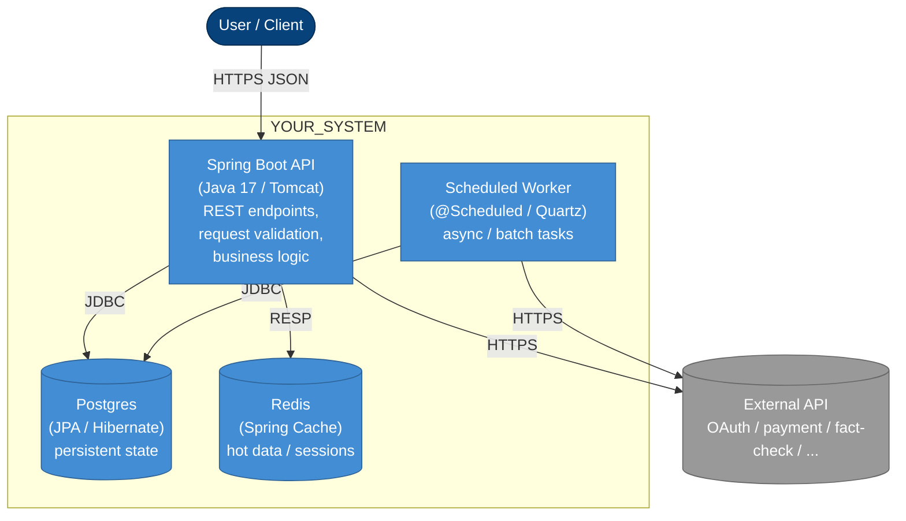

# Container diagram — C4 Level 2

> **Specification perspective.** This is one level deeper than
> `overview.md`. Here we name the runnable containers (API, worker,
> database, cache) and the responsibilities each takes. Frameworks
> and concrete technologies ARE named at this level.
>
> Still not at Code level — `containers.md` doesn't show classes.
> That's Level 3 (components) — deferred to the code itself unless a
> system is exceptionally complex.

## Diagram

## Containers

One row per box in the diagram.

| Container | Technology | Responsibility |
|---|---|---|
| API | Spring Boot 3 / Java 17, Tomcat | REST endpoints, DTO validation, orchestrate services, call DB + external APIs |
| Scheduled Worker | Spring `@Scheduled` or Quartz | Cron jobs, batch enrichment, async cleanup |
| Database | Postgres 16 (JPA / Hibernate) | Persistent state, transactional integrity |
| Cache | Redis (Spring Cache / Redisson) | Session cache, rate-limit counters, hot keys |

Delete any row that isn't used. For example, many MVPs have no
Worker and no Cache — `API + Database` is a legitimate two-container
system.

## Boundary rules (enforced by ArchUnit)

Each container maps to the package layers it's allowed to exercise:

- **API** (`core.api.controller.*`): HTTP layer only. Must not call
  `storage.*` directly — goes through `core.domain.*`
- **Worker** (`core.api.scheduler.*`): same constraints as API, but
  triggered by cron
- **`core.domain`**: business logic; talks to `storage.*`
  **only through repository interfaces** (DIP)
- **`storage.db`**: JPA entities + repositories — never imported by
  controllers (enforced by ArchUnit `layeredArchitecture` rule)
- **`clients.*`**: external API clients; cannot import `storage.*` or
  vice versa (mutual prohibition enforced by ArchUnit)
- **`support.*`**: cross-cutting (error handling, logging, response
  envelope). Importable by all layers.

## Deployment notes

- API + Worker can run as the same Spring Boot process with profiles
  enabling/disabling `@EnableScheduling` — or as separate services if
  traffic warrants
- DB is a managed service (RDS, Supabase, Cloud SQL); migrations live
  in `src/main/resources/db/migration/` (Flyway) or via JPA DDL in
  dev-only profiles
- Cache is managed (ElastiCache, Upstash, Cloud Memorystore) — never
  run local Redis in production

## When to update this file

- A new container is added (e.g. a separate Batch service split off
  from the Worker)
- A container's technology changes (e.g. Postgres → CockroachDB)
- A dependency edge is added or removed
- An ADR lands that shifts the architecture

Changes to this diagram without a corresponding ADR are a red flag —
architecture shifts should be deliberate decisions, not incidental edits.
